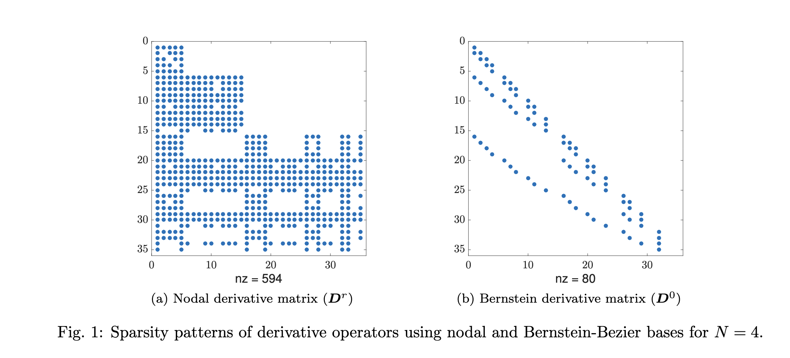
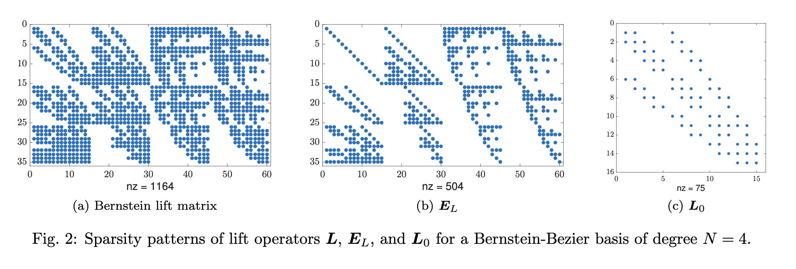
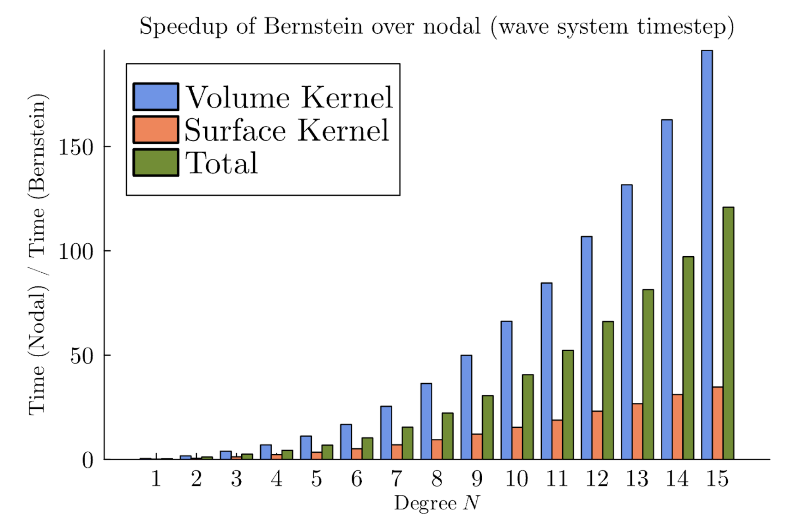
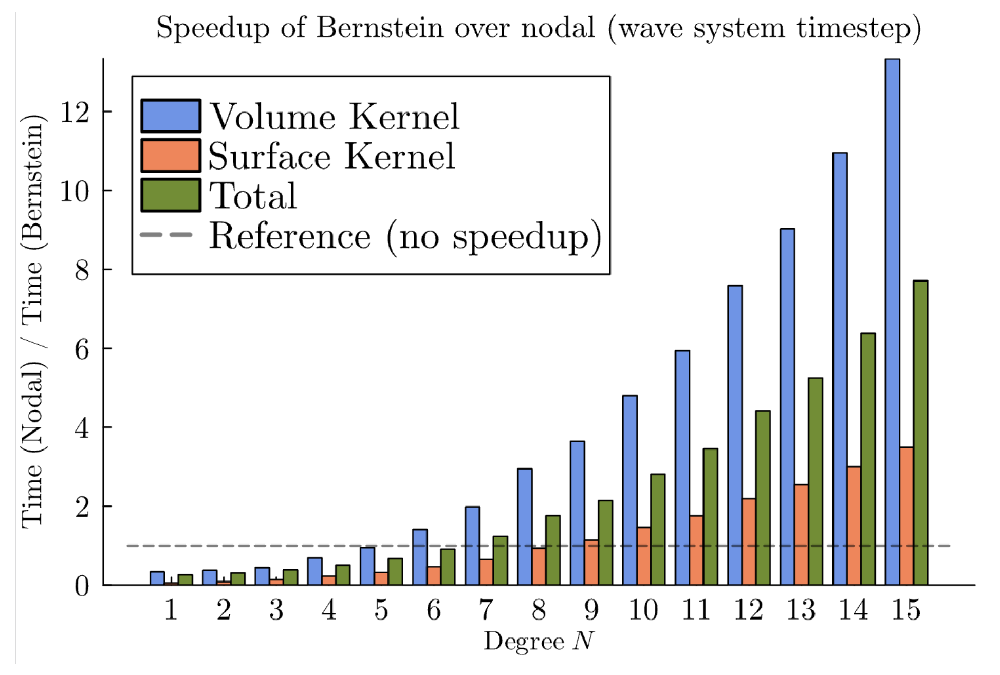

# BernsteinBasis

[This package](https://github.com/vincentxwang/BernsteinBasis.jl) contains performant reference element operators and algorithms for using a Bernstein basis in discontinuous Galerkin methods. The codes are based on [GPU-accelerated Bernstein-Bezier discontinuous Galerkin methods for wave problems](https://arxiv.org/abs/1512.06025) by Chan and Warburton (2017). Examples of using this package in DG solvers can be found in `/examples`.

# Speedups

This package features fast derivative and lift operators that transform in $O(n^3)$ instead of the typical $O(n^5)$ by exploiting density in operators using the Bernstein basis. Particularly, the derivative operator has $\leq4$ elements per row and the lift matrix has a recursive structure, as can be seen below in the two figures from [GPU-accelerated Bernstein-Bezier discontinuous Galerkin methods for wave problems](https://arxiv.org/abs/1512.06025).

For high-order DG simulations (degree of polynomial interpolation $N > 6$), we generally see a significant speedups using BernsteinBasis.jl compared to a *naive* dense matrix multiplication algorithm, as per the graph below.

These numbers are generated on an Apple M2 using Julia-1.10 using the code in `examples/3d_wave.jl`, a solver for the 3D first-order acoustic wave equation. Complete code for performance testing can be found in (this repo)[https://github.com/vincentxwang/julia-impl-bbdg].

Comparing to the Julia implementation of dense matrix multiplication, our operators are generally faster at $N > 6$, as per the graph below.

